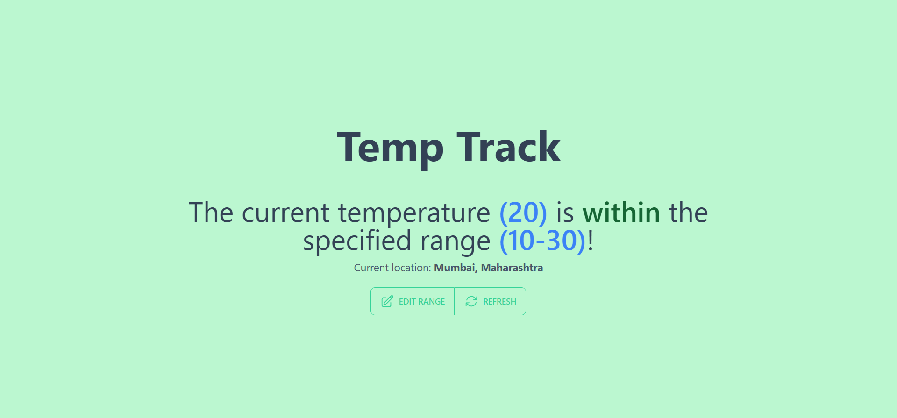
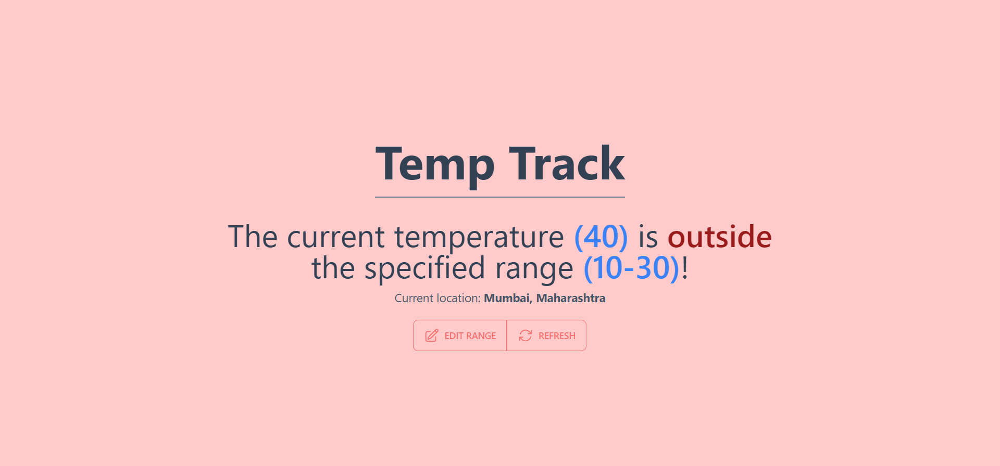
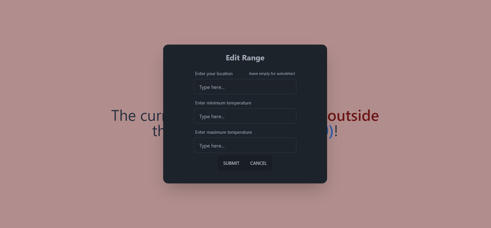

# Temp-Track

A simple application that fetches the current temperature in the location specified and notifies the user when the temperature in that location goes outside the range specified by the user.

# Running the program

- Create a free account on [weatherapi.com](weatherapi.com) and create an API key.
- Copy the `.env.example` to `.env` and paste your API key from [weatherapi.com](weatherapi.com).
- Install the required dependencies for api using `poetry install`.
- Change into the web app directory using `cd temp_track_web`
- Install the required dependencies for web app using `yarn`.
- Build the web app using `yarn build`.
- Move back into the base directory using `cd ..`.
- Run the program using `poetry run python main.py` and head to `http://localhost:3000`

:warning: **NOTE**: This project uses the latest version of `poetry` and there are some breaking changes in how poetry stores its config files so older versions might not work. So, please use the latest version.

# Notifiers

Currently, there are only two notifiers: console notifier which prints to the console from which the program is running and api notifier which provides an api for other to use which is also used by the web app but this can be extended to many other things such as sending an email, a push notification or even a text message. The options are limitless!
